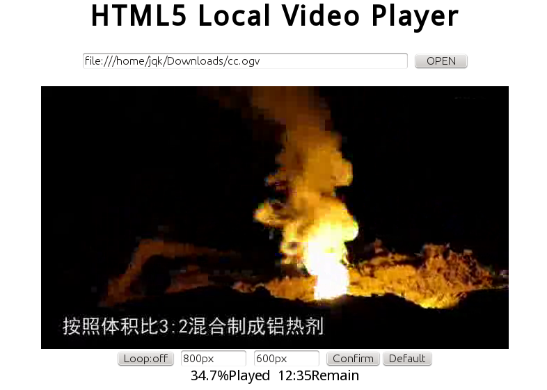
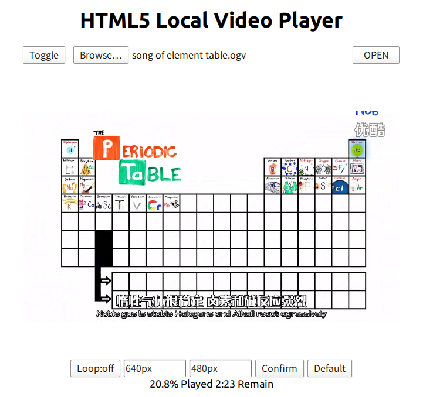
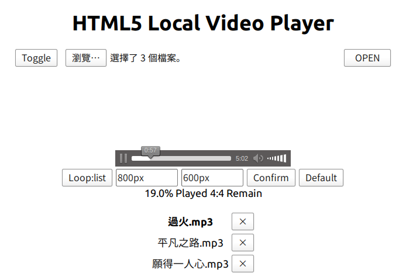

HTML5 本地視頻播放器
===

這所謂「HTML5 本地視頻播放器」，說白了就是一 HTML 頁面，目的是使得使用瀏覽器播放本地視頻更方便。相對正兒八經的播放器功能自然弱得多，可當作 Fallback 使用。

提供功能：

- 基本的視頻播放

- 播放列表，支持拖拽

- 列表循環，洗腦循環

- 顯示已播放百分比和剩餘時間

- 固定大小（縮放）

- 用HTML5本地存儲保存設定的大小，並可清除以使用原始大小。

支持格式取決於瀏覽器。

2013.01 H2O

2014.08 LiOH

2014.12 NaOH

